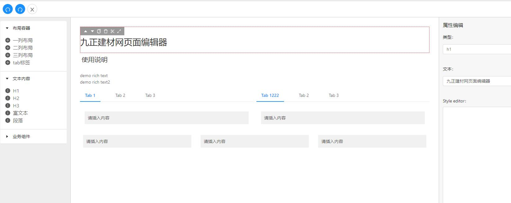

# 概述



页面配置数据编辑器, 流程:
1. 将页面(pc/mobile)dom树(组件)抽象为json数据
2. 可视化编辑抽象数据
3. 进一步将配置对象(树结构)依赖各端组件渲染为
    1. 小程序展示
    2. pc/h5 react/vue或服务端渲染
    
在此基础可进一步拓展:
1. 页面/组件代码生成
2. 表单设计器

## install

```
npm install --save @ckeditor/ckeditor5-react @ckeditor/ckeditor5-build-classic
npm install --save @ckeditor/ckeditor5-build-balloon-block
```

## 核心解决的问题

1. 对数据的管理, 这里使用全局store对整个页面数据进行管理
2. 渲染数据(树)可视化与组件属性编辑
2. 拖拽嵌套的问题, 解决方案[参考](https://react-dnd.github.io/react-dnd/examples/nesting/drop-targets)

## 组件的定义

核心逻辑:　根据组件的存储结构, 渲染/增加子节点/编辑属性高度自治

```typescript
declare interface  Component{
    TYPE:string
    ViewEditor:ComponentType
    PropEditor:ComponentType
    create():ComponentData
    appendChild(selfData:ComponentData, child:ComponentData):void
    props:ComponentDataProps
    child: Component[]
    icon:string
    name:string
    isContainer:boolean
}

declare interface ComponentDataProps {
    value:string|[]
    style:object
    title?:string,
    child?:Component[]
}

declare interface ComponentData {
    id:number
    type:string
    props:ComponentDataProps
}
```

### action

1. 组件.创建初始化()
1. 组件.增加子节点(compenent) : 组件.json
1. 组件.选中(激活组件实例)
3. 组件.视图编辑器渲染(json)
3. 组件.属性编辑渲染(json)

流程

2. 渲染可用组件列表
2. 加载数据结构, 
2. 使用数据渲染编辑区
2. 移动鼠标点击响应可点击区域
2. 激活区域组件
3. 编辑属性

## 配置存储结构

data : json, 参考config/data.js
```
[
    {
        id:int, 唯一id,
        type:string, 组件类型
        props: { 
            // 根据组件自行定义
            "value": string,
            "style": Object,
            "child": []
        },
        child: Array, 子节点
    }
]
```

## 工作区

```
<ComponentsContext.Provider value={componentContextValue}>
<ActiveComponentContext.Provider value={activeContextValue}>
<div className={'j-editor'}>
  <ToolBar history={history} />
  <Row>
    <Col span={3}><ComponentSelector /></Col>
    <Col span={15}><ViewEditor data={data} /></Col>
    <Col span={6}><PropEditor /></Col>
  </Row>
</div>
</ActiveComponentContext.Provider>
</ComponentsContext.Provider>
```


1. 组件选择区 ComponentSelector
1. 组件编辑区 ViewEditor
1. 属性编辑区 PropEditor

### 组件选择区

- 图标化
- 分组

预设组件
- 容器类
    - <s>div布局(1/2/3/4)列, 设置列宽</s>
    - 设置容器标题
- dom
    - slider
    - 富文本
    - <s>标题</s>
    
### 视图编辑区

1. 当前容器对象
    - 可插入新组件
    - 可接收新组件
    - 标识区域
        - 鼠标移动
3. 当前活动对象
    - 移动激活layer
    - 点击选择当前组件
    - 可移动对象
    - 可删除
2. 拖拽
    1. 组件可以通过拖拽放置到容器
    2. 调整同级组件顺序
    3. 将组件整体更换父容器
    

### 属性编辑区

1. 根据配置渲染表单
    - 参考antd表单设计


## todo

- 拖拽时激活组件活动容器
- 全部删除时再增加内容存在问题
- 监听器, 参考dnd

```
render({type, props}) {
    if(type == 'goods') {
        return <Goods {...props} />
    } elseif(type === 'ticket') {
        return <Ticket {...props} />
    } elseif(type === 'tab') {
        return <Tab {...props} />
    } 
}
```

----------------

## 参考 
- [React DnD](https://react-dnd.github.io/react-dnd/examples)
    - [npm: react-drag-and-drop](https://www.npmjs.com/package/react-drag-and-drop)
    - [用 React Hooks 的方式使用 react-dnd](https://juejin.im/post/5d6dd4e4e51d453bb13b6680)
    - [使用 Drag and Drop 给Web应用提升交互体验](https://www.cnblogs.com/jlfw/p/11809988.html)
    - [ReactHooks+ReactDnd实现拖动数据加载](https://segmentfault.com/a/1190000020691892?utm_source=tag-newest)
    - [Drag&Drop 拖放API简介以及在React中的实践](https://blog.csdn.net/weixin_34023982/article/details/91452188)
